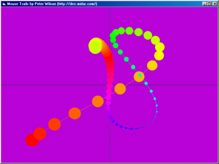



## Technicolor Mouse Trails 2 Mod

### Description

This modified version of Peter Wilson's "Technicolor Mouse Trails 2" uses a simple fps limiter to keep Autoredraw on a leash.
 
### More Info
 

             |
---                |---
**Submitted On**   |2004-01-05 06:27:30
**By**             |[dafhi](https://github.com/Planet-Source-Code/PSCIndex/blob/master/ByAuthor/dafhi.md)
**Level**          |Intermediate
**User Rating**    |5.0 (10 globes from 2 users)
**Compatibility**  |VB 6\.0
**Category**       |[Graphics](https://github.com/Planet-Source-Code/PSCIndex/blob/master/ByCategory/graphics__1-46.md)
**World**          |[Visual Basic](https://github.com/Planet-Source-Code/PSCIndex/blob/master/ByWorld/visual-basic.md)
**Archive File**   |[Technicolo169063152004\.zip](https://github.com/Planet-Source-Code/dafhi-technicolor-mouse-trails-2-mod__1-50795/archive/master.zip)

